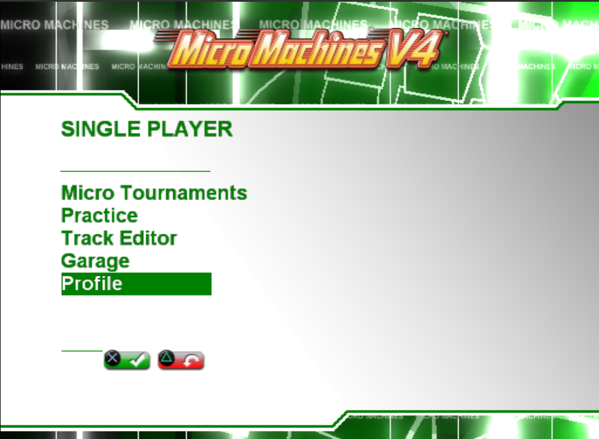
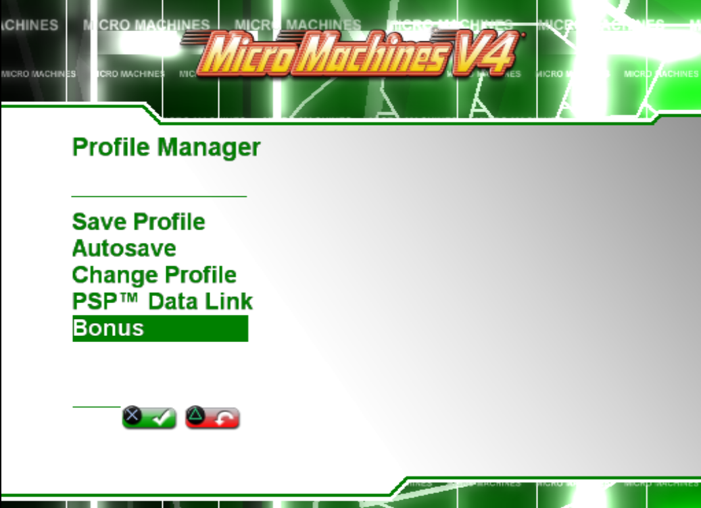
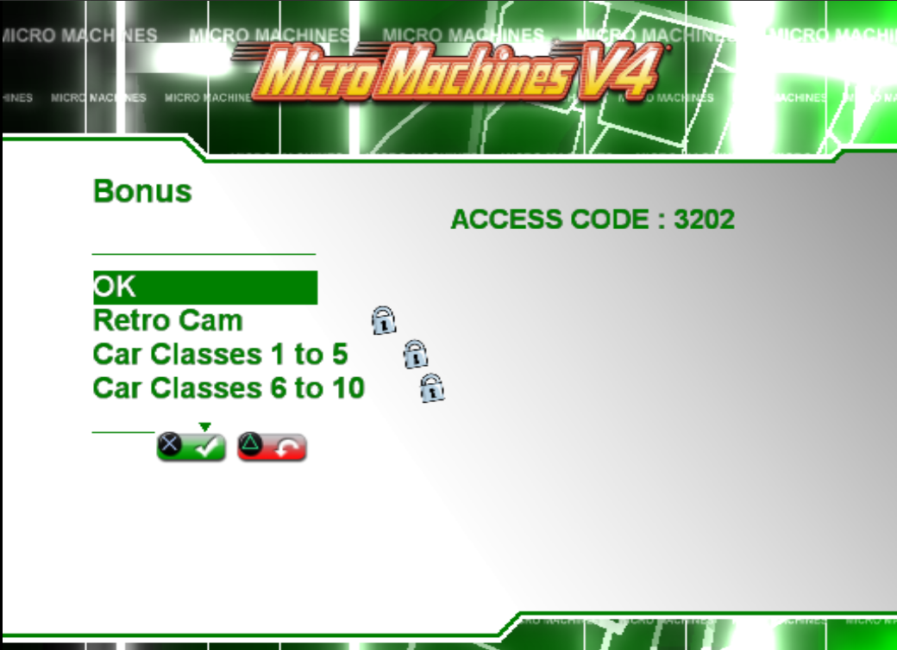
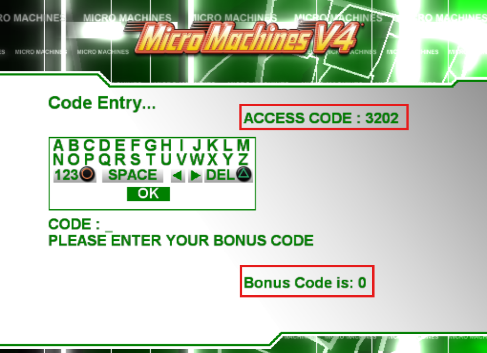

# Micro Machines V4 Bonus Code Generator

A small web app that generates every Micro Machines V4 bonus code from a profile access code.

Available online: [Micro Machines V4 Bonus Code Generator](https://ldevillard.github.io/MicroMachines-V4-Bonus-Code-Generator/)

Read the article: [Reverse Engineering Micro Machines V4's Bonus Code System](https://medium.com/@logandvllrd/reverse-engineering-micro-machines-v4s-bonus-code-system-8e15830014f5)

Supports:

- ✅ **PC**
- ✅ **PlayStation 2**
- ✅ **PSP**
- ➖ **Nintendo DS** - bonus code system not available
- ✅ All **10 in-game bonuses**

## Usage

**1.** Open **Profile** from the main menu.

**2.** Select **Bonus** in the Profile Manager.

**3.** Enter the displayed access code in the generator.

**4.** Select a locked bonus and enter its generated code.

